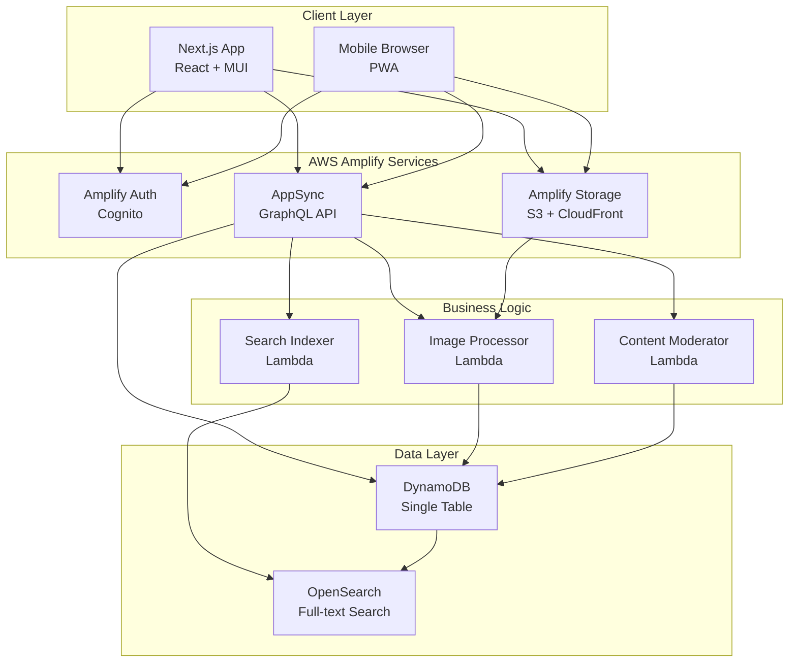
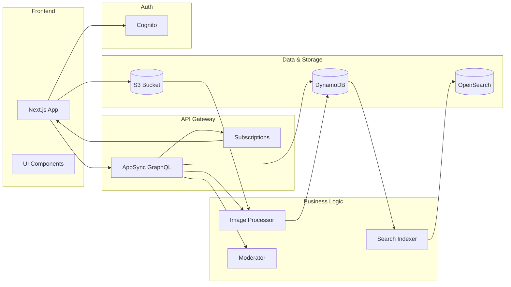
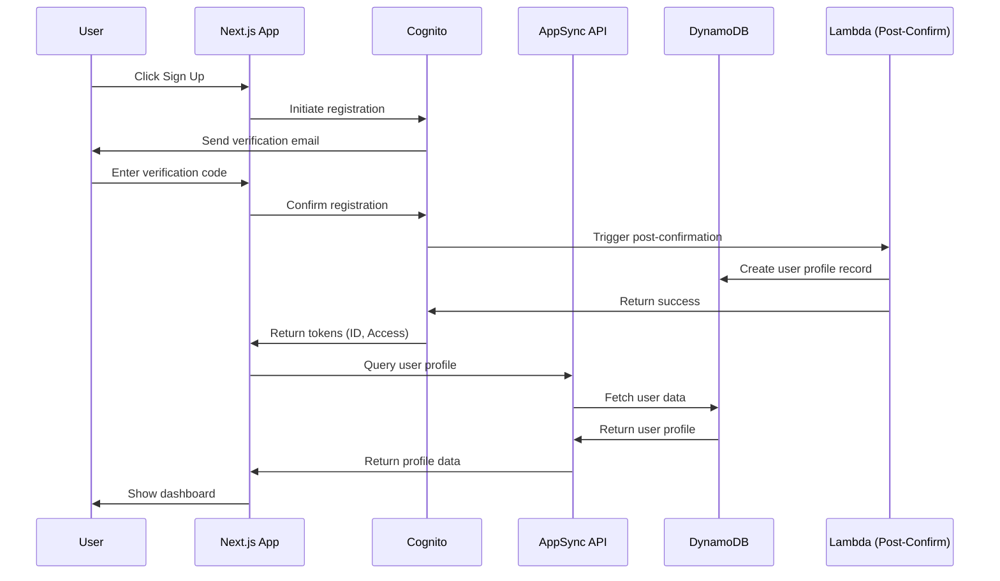
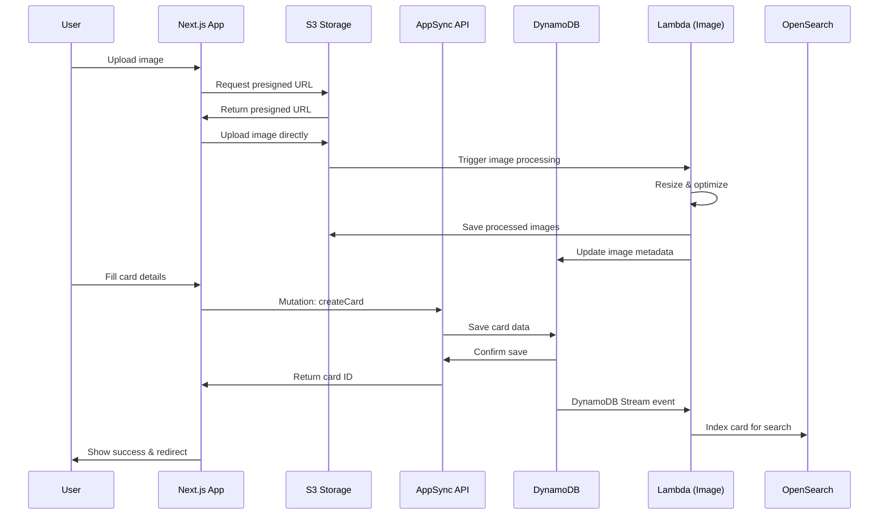
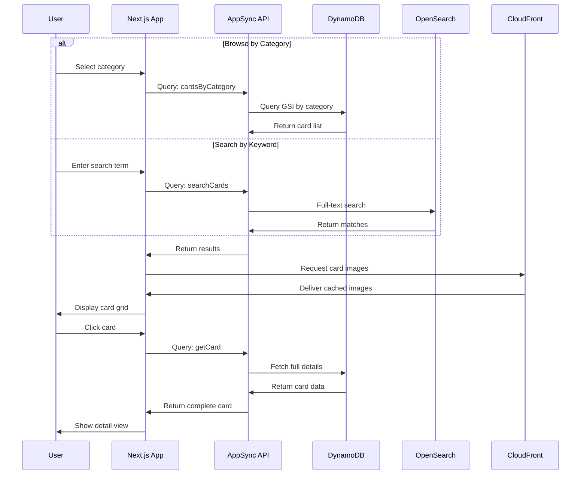
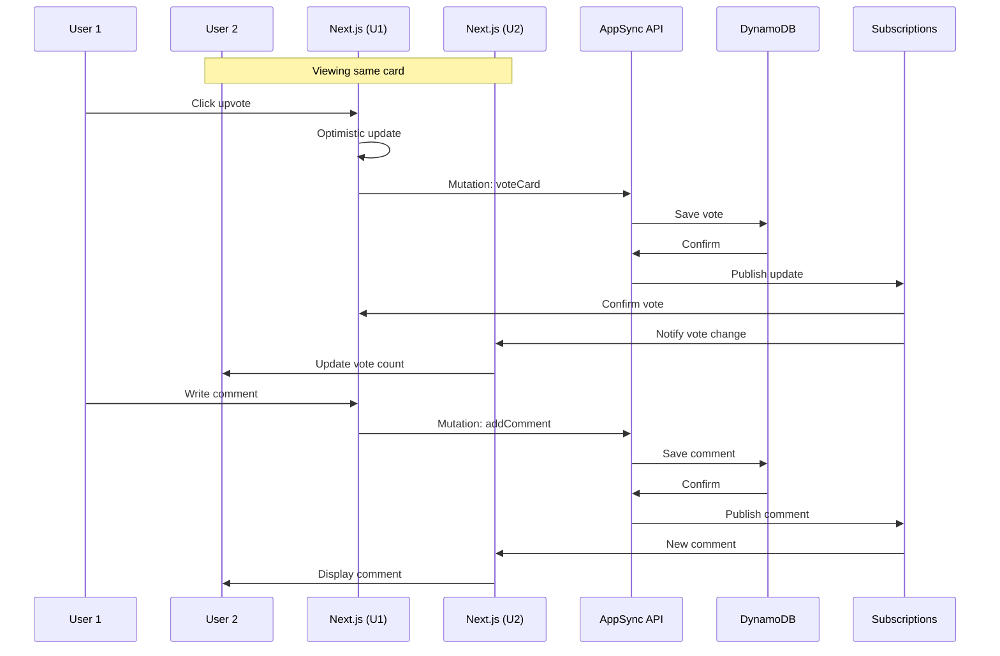
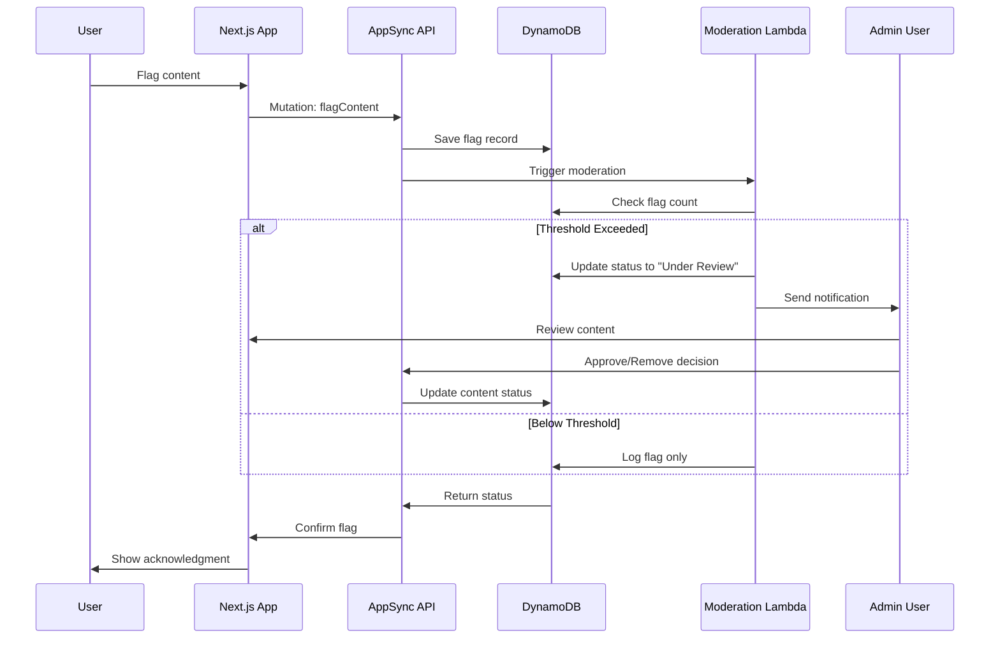
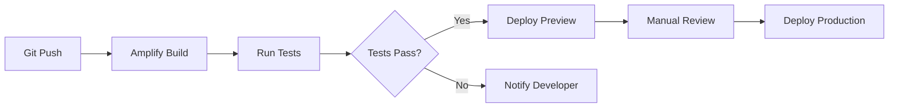
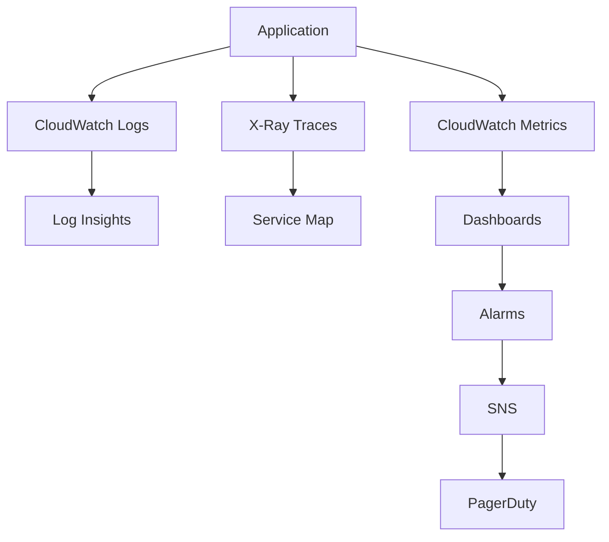

# PerfectIt Architecture Document

## Introduction

This document outlines the overall project architecture for PerfectIt, including backend systems, shared services, and non-UI specific concerns. Its primary goal is to serve as the guiding architectural blueprint for AI-driven development, ensuring consistency and adherence to chosen patterns and technologies.

**Relationship to Frontend Architecture:**
If the project includes a significant user interface, a separate Frontend Architecture Document will detail the frontend-specific design and MUST be used in conjunction with this document. Core technology stack choices documented herein (see "Tech Stack") are definitive for the entire project, including any frontend components.

### Starter Template or Existing Project

Based on your clarification, this project uses the **AWS Amplify Next.js Template** as its foundation:

- **Template Source:** https://github.com/aws-samples/amplify-next-template
- **Template Type:** Official AWS sample template for Amplify Gen 2 with Next.js
- **Key Features:** Pre-configured Next.js 14+ App Router, Amplify Gen 2 backend setup, TypeScript support, authentication scaffolding

**Decision:** Clone and customize the `amplify-next-template` which provides:

- Pre-configured monorepo structure with Next.js and Amplify backend
- Working authentication setup with Amplify Auth
- Example data models and API configuration
- Deployment pipeline configuration for Amplify Hosting
- Best practices for Amplify Gen 2 development

This template accelerates development by providing a production-ready foundation that aligns with AWS best practices.

### Change Log

| Date       | Version | Description                   | Author    |
| ---------- | ------- | ----------------------------- | --------- |
| 2025-08-08 | 1.0     | Initial Architecture Document | Architect |

## High Level Architecture

### Technical Summary

PerfectIt employs a serverless architecture using AWS Amplify Gen 2, delivering a visual knowledge-sharing platform through event-driven patterns and managed AWS services. The system combines Next.js for server-side rendering with AppSync GraphQL API for real-time data operations, DynamoDB for scalable NoSQL storage, and S3/CloudFront for optimized image delivery. Core architectural patterns include CQRS for separating read/write operations, event-driven updates via AppSync subscriptions, and single-table design for DynamoDB optimization. This architecture directly supports the PRD goals of enabling rapid content discovery, real-time community engagement, and cost-effective scaling from startup to 10,000+ users.

### High Level Overview

**Architectural Style:** Serverless, Event-Driven Architecture leveraging AWS managed services for automatic scaling and operational simplicity.

**Repository Structure:** Monorepo (as specified in PRD) containing:

- `/app` - Next.js frontend application
- `/amplify` - Backend resource definitions (auth, data, storage, functions)
- `/components` - Shared React components
- Unified deployment and version control

**Service Architecture:** AWS Amplify Gen 2 Serverless with:

- AppSync GraphQL API as the primary service interface
- Lambda functions for custom business logic (image processing, moderation)
- DynamoDB for primary data storage with single-table design
- S3 + CloudFront for image storage and delivery
- Cognito for authentication and user management

**Primary User Flow:**

1. Users authenticate via Cognito (social or email/password)
2. Browse/search Perfection Cards through AppSync queries
3. Upload images to S3 via presigned URLs
4. Create/interact with content through GraphQL mutations
5. Receive real-time updates via AppSync subscriptions

**Key Architectural Decisions:**

- **Serverless-first:** Eliminates server management, provides automatic scaling
- **GraphQL over REST:** Enables precise data fetching, real-time subscriptions
- **Single-table DynamoDB:** Optimizes for cost and performance at scale
- **CDN-first media:** Reduces latency and backend load for images

### High Level Project Diagram



### Architectural and Design Patterns

- **Serverless Architecture:** Using AWS Lambda and managed services - _Rationale:_ Aligns with PRD requirement for cost optimization within $50K budget, scales automatically from 0 to 10,000+ users
- **CQRS (Command Query Responsibility Segregation):** Separate GraphQL resolvers for reads (queries) and writes (mutations) - _Rationale:_ Optimizes read performance for browsing/discovery while maintaining data consistency for card creation
- **Event-Driven Processing:** S3 events trigger Lambda for image processing, DynamoDB streams for search indexing - _Rationale:_ Enables asynchronous processing without blocking user interactions
- **Single-Table Design:** All entities in one DynamoDB table with composite keys - _Rationale:_ Reduces costs, improves query performance, simplifies data model as recommended for DynamoDB best practices
- **Repository Pattern:** Abstract data access through Amplify Data models - _Rationale:_ Provides clean separation between business logic and data layer, enables future migration if needed
- **Optimistic UI Updates:** Client-side state updates before server confirmation - _Rationale:_ Provides instant feedback for votes/comments improving perceived performance
- **Circuit Breaker Pattern:** For external service calls (OpenSearch, image processing) - _Rationale:_ Prevents cascade failures and provides graceful degradation

## Tech Stack

### Cloud Infrastructure

- **Provider:** Amazon Web Services (AWS)
- **Key Services:** Amplify, AppSync, DynamoDB, S3, CloudFront, Cognito, Lambda, OpenSearch
- **Deployment Regions:** us-east-1 (primary), with CloudFront global edge locations

### Technology Stack Table

| Category               | Technology         | Version | Purpose                      | Rationale                                                |
| ---------------------- | ------------------ | ------- | ---------------------------- | -------------------------------------------------------- |
| **Language**           | TypeScript         | 5.3.3   | Primary development language | Strong typing, excellent tooling, reduces runtime errors |
| **Runtime**            | Node.js            | 20.11.0 | JavaScript runtime           | LTS version, stable performance, AWS Lambda support      |
| **Frontend Framework** | Next.js            | 14.2.0  | React framework with SSR/SSG | App Router, optimal performance, SEO benefits            |
| **UI Library**         | React              | 18.3.0  | Component library            | Industry standard, huge ecosystem, Amplify UI support    |
| **UI Components**      | Amplify UI React   | 6.1.0   | Connected components         | Pre-built auth, storage, data components                 |
| **UI Design System**   | Material-UI (MUI)  | 5.15.0  | Component library            | Comprehensive components, theming, accessibility         |
| **Backend Framework**  | AWS Amplify Gen 2  | 1.0.0   | Backend infrastructure       | Integrated AWS services, type-safe, real-time            |
| **API**                | AWS AppSync        | Managed | GraphQL API                  | Real-time subscriptions, managed scaling                 |
| **Database**           | DynamoDB           | Managed | NoSQL database               | Serverless, scalable, cost-effective                     |
| **Authentication**     | AWS Cognito        | Managed | User management              | Social login, MFA, integrated with Amplify               |
| **Storage**            | AWS S3             | Managed | Object storage               | Image storage, integrated with CloudFront                |
| **CDN**                | CloudFront         | Managed | Content delivery             | Global edge locations, S3 integration                    |
| **Search**             | OpenSearch         | 2.11    | Full-text search             | Advanced search capabilities, DynamoDB integration       |
| **Image Processing**   | Sharp              | 0.33.2  | Image manipulation           | Resize, optimize, format conversion in Lambda            |
| **State Management**   | Amplify DataStore  | 5.0.0   | Offline-first sync           | Conflict resolution, real-time sync                      |
| **CSS Framework**      | MUI Styling System | 5.15.0  | CSS-in-JS                    | sx prop, styled components, theme consistency            |
| **Testing**            | Jest               | 29.7.0  | Test framework               | Unit/integration testing, good TS support                |
| **Testing (E2E)**      | Playwright         | 1.41.0  | E2E testing                  | Cross-browser, reliable, fast                            |
| **Linting**            | ESLint             | 8.56.0  | Code quality                 | Catches errors, enforces standards                       |
| **Formatting**         | Prettier           | 3.2.0   | Code formatting              | Consistent style, auto-format                            |
| **Git Hooks**          | Husky              | 9.0.0   | Pre-commit hooks             | Enforce quality before commit                            |
| **Package Manager**    | npm                | 10.2.0  | Dependency management        | Default with Node.js, workspace support                  |
| **CI/CD**              | Amplify Hosting    | Managed | Deployment pipeline          | Automatic deployments, preview environments              |
| **Monitoring**         | CloudWatch         | Managed | Logs and metrics             | Integrated with all AWS services                         |
| **Tracing**            | AWS X-Ray          | Managed | Distributed tracing          | Performance analysis, debugging                          |

## Data Models

### User

**Purpose:** Represents authenticated users with profile information and reputation tracking

**Key Attributes:**

- id: String (UUID) - Unique identifier from Cognito
- username: String - Unique display name
- email: String - Contact email (private)
- avatarUrl: String - Profile image S3 URL
- bio: String - User description (max 500 chars)
- expertiseTags: String[] - Areas of expertise
- reputationScore: Number - Calculated reputation points
- joinedAt: DateTime - Registration timestamp
- isVerified: Boolean - Expert verification status
- socialLinks: Map - Social media profiles

**Relationships:**

- Has many PerfectionCards (author)
- Has many Comments
- Has many Votes
- Has many Collections
- Has many UserFollows (followers/following)

### PerfectionCard

**Purpose:** Core content entity containing improvement instructions for specific items

**Key Attributes:**

- id: String (UUID) - Unique identifier
- title: String - Card title (max 100 chars)
- description: String - Brief summary (max 500 chars)
- imageUrls: String[] - S3 URLs for card images
- instructions: String[] - Step-by-step instructions
- materials: Material[] - Required materials list
- tools: String[] - Required tools
- category: String - Primary category
- tags: String[] - Searchable tags
- difficulty: Enum (Beginner|Intermediate|Expert)
- estimatedTime: Number - Minutes to complete
- estimatedCost: Number - USD cost estimate
- viewCount: Number - Total views
- voteScore: Number - Net votes (up - down)
- authorId: String - Reference to User
- createdAt: DateTime
- updatedAt: DateTime
- status: Enum (Draft|Published|Flagged|Removed)

**Relationships:**

- Belongs to User (author)
- Has many Comments
- Has many Votes
- Belongs to many Collections

### Comment

**Purpose:** User discussions and feedback on Perfection Cards

**Key Attributes:**

- id: String (UUID)
- content: String - Comment text (max 1000 chars)
- cardId: String - Reference to PerfectionCard
- authorId: String - Reference to User
- parentId: String - For nested replies (optional)
- voteCount: Number - Helpful votes
- createdAt: DateTime
- editedAt: DateTime
- status: Enum (Active|Flagged|Removed)

**Relationships:**

- Belongs to PerfectionCard
- Belongs to User (author)
- Has many Comments (replies)
- Has many CommentVotes

### Vote

**Purpose:** Track user votes on cards and comments

**Key Attributes:**

- id: String (Composite: userId#targetId)
- userId: String - Voter reference
- targetId: String - Card or Comment ID
- targetType: Enum (Card|Comment)
- voteType: Enum (Up|Down)
- createdAt: DateTime

**Relationships:**

- Belongs to User
- Belongs to PerfectionCard or Comment

### Collection

**Purpose:** User-created groups of saved Perfection Cards

**Key Attributes:**

- id: String (UUID)
- name: String - Collection title
- description: String - Optional description
- ownerId: String - Reference to User
- isPublic: Boolean - Visibility setting
- cardIds: String[] - References to PerfectionCards
- followerCount: Number - Users following collection
- createdAt: DateTime
- updatedAt: DateTime

**Relationships:**

- Belongs to User (owner)
- Has many PerfectionCards
- Has many CollectionFollowers

### Category

**Purpose:** Hierarchical organization structure for browsing

**Key Attributes:**

- id: String - URL-safe identifier
- name: String - Display name
- parentId: String - Parent category (optional)
- description: String
- iconUrl: String - Category icon
- cardCount: Number - Total cards in category
- sortOrder: Number - Display ordering

**Relationships:**

- Has many PerfectionCards
- Has many Categories (subcategories)

## Components

### Frontend Application

**Responsibility:** Next.js application providing the user interface, server-side rendering, and client-side interactivity

**Key Interfaces:**

- HTTP/HTTPS endpoints for page routes
- GraphQL client connection to AppSync API
- Amplify Auth integration for authentication flows
- Amplify Storage integration for image uploads

**Dependencies:** AppSync API, Cognito, S3/CloudFront

**Technology Stack:** Next.js 14.2, React 18.3, TypeScript, MUI 5.15, Amplify UI React 6.1, Tailwind CSS

### GraphQL API Layer

**Responsibility:** AppSync managed GraphQL API providing data operations, real-time subscriptions, and authorization

**Key Interfaces:**

- GraphQL schema with Queries, Mutations, and Subscriptions
- Type-safe resolvers for all data operations
- WebSocket connections for real-time updates
- Authorization rules per field/operation

**Dependencies:** DynamoDB, Lambda Functions, Cognito

**Technology Stack:** AWS AppSync (managed), GraphQL schema defined in Amplify

### Authentication Service

**Responsibility:** Cognito user pool managing user registration, authentication, and authorization

**Key Interfaces:**

- User registration and verification endpoints
- OAuth 2.0 flows for social login (Google, Facebook)
- JWT token generation and validation
- User group management for roles

**Dependencies:** None (foundational service)

**Technology Stack:** AWS Cognito (managed), Amplify Auth configuration

### Data Storage Layer

**Responsibility:** DynamoDB tables storing all application data with single-table design pattern

**Key Interfaces:**

- Single table with composite keys for all entities
- Global Secondary Indexes (GSIs) for query patterns
- DynamoDB Streams for change events
- Batch read/write operations

**Dependencies:** None (foundational service)

**Technology Stack:** AWS DynamoDB (managed), single-table design

### Image Processing Service

**Responsibility:** Lambda function processing uploaded images for optimization and multiple sizes

**Key Interfaces:**

- S3 event trigger on image upload
- Image resize to multiple dimensions (thumbnail, medium, large)
- Format optimization (WebP conversion)
- Metadata extraction and storage

**Dependencies:** S3, DynamoDB

**Technology Stack:** Node.js Lambda, Sharp 0.33.2, TypeScript

### Content Moderation Service

**Responsibility:** Lambda function reviewing flagged content and automating moderation workflows

**Key Interfaces:**

- AppSync resolver integration for flag operations
- Moderation queue management
- Automated content analysis rules
- Admin notification system

**Dependencies:** DynamoDB, AppSync API

**Technology Stack:** Node.js Lambda, TypeScript, AWS SDK

### Search Service

**Responsibility:** Lambda function managing OpenSearch indexing and search operations

**Key Interfaces:**

- DynamoDB Streams consumer for index updates
- Search query API endpoint
- Index management operations
- Relevance scoring algorithms

**Dependencies:** DynamoDB Streams, OpenSearch

**Technology Stack:** Node.js Lambda, OpenSearch client, TypeScript

### Media Storage

**Responsibility:** S3 bucket and CloudFront CDN storing and delivering images

**Key Interfaces:**

- Presigned URL generation for uploads
- CloudFront distribution for global delivery
- Image access policies and CORS configuration
- Lifecycle policies for cost optimization

**Dependencies:** None (foundational service)

**Technology Stack:** AWS S3 (managed), CloudFront CDN (managed)

### Component Diagrams



## External APIs

### Google OAuth API

- **Purpose:** Enable user authentication via Google accounts
- **Documentation:** https://developers.google.com/identity/protocols/oauth2
- **Base URL(s):** https://accounts.google.com/o/oauth2/v2/auth
- **Authentication:** OAuth 2.0 flow managed by Cognito
- **Rate Limits:** 10,000 requests per day (free tier)

**Key Endpoints Used:**

- `GET /auth` - Initial authorization request
- `POST /token` - Exchange authorization code for tokens
- `GET /userinfo` - Retrieve user profile information

**Integration Notes:** Handled entirely through Cognito Identity Providers configuration. Requires Google Cloud Console project with OAuth 2.0 credentials.

### Facebook Login API

- **Purpose:** Enable user authentication via Facebook accounts
- **Documentation:** https://developers.facebook.com/docs/facebook-login
- **Base URL(s):** https://www.facebook.com/v18.0/dialog/oauth
- **Authentication:** OAuth 2.0 flow managed by Cognito
- **Rate Limits:** 200 calls per hour per user

**Key Endpoints Used:**

- `GET /dialog/oauth` - Initial authorization dialog
- `GET /oauth/access_token` - Exchange code for access token
- `GET /me` - Retrieve user profile data

**Integration Notes:** Managed through Cognito Identity Providers. Requires Facebook App ID and App Secret from Facebook Developer Console.

## Core Workflows

### User Registration and Authentication Flow



### Create Perfection Card Workflow



### Browse and Search Workflow



### Real-time Voting and Comments



### Content Moderation Workflow



## Amplify Data Model (TypeScript)

In Amplify Gen 2, the data model is defined in TypeScript and Amplify automatically generates the GraphQL schema. Here's the data model definition for `amplify/data/resource.ts`:

```typescript
import { type ClientSchema, a, defineData } from '@aws-amplify/backend';

const schema = a.schema({
  User: a
    .model({
      username: a.string().required(),
      email: a.email(),
      avatarUrl: a.url(),
      bio: a.string(),
      expertiseTags: a.string().array(),
      reputationScore: a.integer().default(0),
      isVerified: a.boolean().default(false),
      socialLinks: a.json(),
      cards: a.hasMany('PerfectionCard', 'authorId'),
      comments: a.hasMany('Comment', 'authorId'),
      votes: a.hasMany('Vote', 'userId'),
      collections: a.hasMany('Collection', 'ownerId'),
    })
    .authorization((allow) => [
      allow.owner(),
      allow.authenticated().to(['read']),
      allow.guest().to(['read']),
    ])
    .secondaryIndexes((index) => [index('username')]),

  PerfectionCard: a
    .model({
      title: a.string().required(),
      description: a.string().required(),
      imageUrls: a.url().array().required(),
      instructions: a.string().array().required(),
      materials: a.json(), // Array of Material objects
      tools: a.string().array(),
      category: a.string().required(),
      tags: a.string().array(),
      difficulty: a.enum(['BEGINNER', 'INTERMEDIATE', 'EXPERT']),
      estimatedTime: a.integer(), // in minutes
      estimatedCost: a.float(), // in USD
      viewCount: a.integer().default(0),
      voteScore: a.integer().default(0),
      status: a.enum(['DRAFT', 'PUBLISHED', 'FLAGGED', 'REMOVED']),
      authorId: a.id().required(),
      author: a.belongsTo('User', 'authorId'),
      comments: a.hasMany('Comment', 'cardId'),
      votes: a.hasMany('Vote', 'targetId'),
    })
    .authorization((allow) => [
      allow.owner(),
      allow.authenticated().to(['read']),
      allow.guest().to(['read']),
      allow.group('moderator').to(['update', 'delete']),
    ])
    .secondaryIndexes((index) => [
      index('category').sortKeys(['createdAt']).queryField('cardsByCategory'),
      index('authorId').sortKeys(['createdAt']).queryField('cardsByAuthor'),
    ]),

  Comment: a
    .model({
      content: a.string().required(),
      cardId: a.id().required(),
      card: a.belongsTo('PerfectionCard', 'cardId'),
      authorId: a.id().required(),
      author: a.belongsTo('User', 'authorId'),
      parentId: a.id(), // For nested replies
      voteCount: a.integer().default(0),
      status: a.enum(['ACTIVE', 'FLAGGED', 'REMOVED']),
    })
    .authorization((allow) => [
      allow.owner(),
      allow.authenticated().to(['read']),
      allow.guest().to(['read']),
      allow.group('moderator').to(['delete']),
    ])
    .secondaryIndexes((index) => [
      index('cardId').sortKeys(['createdAt']),
      index('parentId').sortKeys(['createdAt']),
    ]),

  Vote: a
    .model({
      userId: a.id().required(),
      user: a.belongsTo('User', 'userId'),
      targetId: a.id().required(),
      targetType: a.enum(['CARD', 'COMMENT']),
      voteType: a.enum(['UP', 'DOWN']),
    })
    .authorization((allow) => [allow.owner(), allow.authenticated().to(['read'])])
    .secondaryIndexes((index) => [
      index('targetId').sortKeys(['userId']),
      index('userId').sortKeys(['targetId']),
    ]),

  Collection: a
    .model({
      name: a.string().required(),
      description: a.string(),
      ownerId: a.id().required(),
      owner: a.belongsTo('User', 'ownerId'),
      isPublic: a.boolean().default(true),
      cardIds: a.id().array(),
      followerCount: a.integer().default(0),
    })
    .authorization((allow) => [
      allow.owner(),
      allow.authenticated().to(['read']),
      allow
        .guest()
        .to(['read'])
        .when((c) => c.isPublic.eq(true)),
    ])
    .secondaryIndexes((index) => [index('ownerId'), index('isPublic').sortKeys(['followerCount'])]),

  Category: a
    .model({
      name: a.string().required(),
      parentId: a.id(),
      description: a.string(),
      iconUrl: a.url(),
      cardCount: a.integer().default(0),
      sortOrder: a.integer().default(0),
    })
    .authorization((allow) => [
      allow.group('admin'),
      allow.authenticated().to(['read']),
      allow.guest().to(['read']),
    ])
    .secondaryIndexes((index) => [index('parentId').sortKeys(['sortOrder'])]),
});

export type Schema = ClientSchema<typeof schema>;

export const data = defineData({
  schema,
  authorizationModes: {
    defaultAuthorizationMode: 'userPool',
    apiKeyAuthorizationMode: {
      expiresInDays: 30,
    },
  },
});
```

This TypeScript schema definition:

- Automatically generates the GraphQL schema
- Provides type-safe client code generation
- Defines authorization rules inline
- Creates DynamoDB tables with appropriate indexes
- Handles relationships between models

## Database Schema

### DynamoDB Single-Table Design

PerfectIt uses a single-table design pattern in DynamoDB for optimal performance and cost efficiency. This approach minimizes the number of tables and requests while supporting all access patterns.

**Table Name:** `perfectit-main`

**Primary Key Structure:**

- **Partition Key (PK):** Entity type and ID composite
- **Sort Key (SK):** Entity-specific sorting/relationship data

### Entity Patterns

| Entity           | PK                          | SK                                | GSI1PK                      | GSI1SK                | GSI2PK            | GSI2SK                |
| ---------------- | --------------------------- | --------------------------------- | --------------------------- | --------------------- | ----------------- | --------------------- |
| User             | `USER#<userId>`             | `PROFILE`                         | `USERNAME#<username>`       | `PROFILE`             | -                 | -                     |
| PerfectionCard   | `CARD#<cardId>`             | `METADATA`                        | `CAT#<category>`            | `CREATED#<timestamp>` | `USER#<authorId>` | `CREATED#<timestamp>` |
| Comment          | `CARD#<cardId>`             | `COMMENT#<timestamp>#<commentId>` | `USER#<authorId>`           | `COMMENT#<timestamp>` | -                 | -                     |
| Vote             | `VOTE#<userId>#<targetId>`  | `VOTE`                            | `TARGET#<targetId>`         | `VOTE#<timestamp>`    | -                 | -                     |
| Collection       | `USER#<userId>`             | `COLLECTION#<collectionId>`       | `COLLECTION#<collectionId>` | `METADATA`            | -                 | -                     |
| CardInCollection | `COLLECTION#<collectionId>` | `CARD#<cardId>`                   | -                           | -                     | -                 | -                     |
| Category         | `CAT#<categoryId>`          | `METADATA`                        | `PARENT#<parentId>`         | `SORT#<sortOrder>`    | -                 | -                     |

### Global Secondary Indexes (GSIs)

**GSI1: Category and Username Index**

- Supports queries by category, username lookups
- Access patterns: Browse cards by category, find user by username

**GSI2: Author Index**

- Supports queries for all content by a specific author
- Access patterns: User's cards, user's comments

**GSI3: Time-based Queries**

- PK: `DATE#<YYYY-MM-DD>`, SK: `CREATED#<timestamp>#<entityId>`
- Access patterns: Trending content, recent cards, daily analytics

**GSI4: Search Support**

- PK: `SEARCH#<searchableField>`, SK: `CARD#<cardId>`
- Limited text search before OpenSearch integration

**GSI5: Vote Aggregation**

- PK: `VOTETYPE#<type>`, SK: `SCORE#<score>#<targetId>`
- Access patterns: Top voted cards, controversial content

### Access Patterns

| Access Pattern         | Index | Query                                                               |
| ---------------------- | ----- | ------------------------------------------------------------------- |
| Get user profile       | Main  | PK=`USER#<userId>`, SK=`PROFILE`                                    |
| Get user by username   | GSI1  | PK=`USERNAME#<username>`                                            |
| List cards by category | GSI1  | PK=`CAT#<category>`, SK begins_with `CREATED#`                      |
| List cards by author   | GSI2  | PK=`USER#<authorId>`, SK begins_with `CREATED#`                     |
| Get card details       | Main  | PK=`CARD#<cardId>`, SK=`METADATA`                                   |
| Get card comments      | Main  | PK=`CARD#<cardId>`, SK begins_with `COMMENT#`                       |
| Get user collections   | Main  | PK=`USER#<userId>`, SK begins_with `COLLECTION#`                    |
| Get collection cards   | Main  | PK=`COLLECTION#<collectionId>`, SK begins_with `CARD#`              |
| Check user vote        | Main  | PK=`VOTE#<userId>#<targetId>`                                       |
| Get trending cards     | GSI3  | PK=`DATE#<today>`, limit 20                                         |
| Get top voted          | GSI5  | PK=`VOTETYPE#CARD`, SK begins_with `SCORE#`, ScanIndexForward=false |

### DynamoDB Streams Configuration

- **Stream View Type:** NEW_AND_OLD_IMAGES
- **Lambda Triggers:**
  - Search indexer (updates OpenSearch)
  - Analytics aggregator (updates metrics)
  - Notification processor (sends real-time updates)

### Data Types and Attributes

Common attributes stored in item body:

```json
{
  "PK": "CARD#123",
  "SK": "METADATA",
  "entityType": "PerfectionCard",
  "id": "123",
  "title": "Perfect Wood Finish",
  "description": "...",
  "imageUrls": [...],
  "instructions": [...],
  "materials": {...},
  "tools": [...],
  "category": "woodworking",
  "tags": ["furniture", "finishing"],
  "difficulty": "INTERMEDIATE",
  "estimatedTime": 120,
  "estimatedCost": 50,
  "viewCount": 0,
  "voteScore": 0,
  "authorId": "user123",
  "status": "PUBLISHED",
  "createdAt": "2025-01-01T00:00:00Z",
  "updatedAt": "2025-01-01T00:00:00Z",
  "GSI1PK": "CAT#woodworking",
  "GSI1SK": "CREATED#2025-01-01T00:00:00Z",
  "GSI2PK": "USER#user123",
  "GSI2SK": "CREATED#2025-01-01T00:00:00Z"
}
```

### Cost Optimization Strategies

- **On-Demand Pricing:** Start with on-demand, switch to provisioned when patterns stabilize
- **TTL for Temporary Data:** Set TTL on draft cards, old notifications
- **Compression:** Store large text fields (instructions) as compressed JSON
- **Batch Operations:** Use BatchGetItem and BatchWriteItem for bulk operations
- **Caching:** CloudFront for images, API Gateway caching for popular queries

## Source Tree

The PerfectIt project follows the AWS Amplify Gen 2 monorepo structure based on the amplify-next-template:

```
perfectit/
├── .amplify/                     # Amplify CLI generated files (gitignored)
├── .next/                        # Next.js build output (gitignored)
├── amplify/                      # Backend configuration
│   ├── auth/                     # Authentication resource
│   │   └── resource.ts          # Cognito configuration
│   ├── data/                     # Data layer
│   │   ├── resource.ts          # DynamoDB models & GraphQL schema
│   │   └── custom-resolvers/    # Custom business logic resolvers
│   ├── functions/                # Lambda functions
│   │   ├── image-processor/
│   │   │   ├── handler.ts      # Image processing logic
│   │   │   ├── package.json
│   │   │   └── tsconfig.json
│   │   ├── content-moderator/
│   │   │   └── handler.ts      # Moderation logic
│   │   ├── search-indexer/
│   │   │   └── handler.ts      # OpenSearch sync
│   │   └── post-confirmation/
│   │       └── handler.ts      # User profile creation
│   ├── storage/                  # S3 configuration
│   │   └── resource.ts          # Bucket policies & triggers
│   └── backend.ts               # Main backend configuration
├── app/                          # Next.js App Router
│   ├── (auth)/                   # Auth group route
│   │   ├── login/
│   │   │   └── page.tsx
│   │   ├── register/
│   │   │   └── page.tsx
│   │   └── layout.tsx          # Auth layout wrapper
│   ├── (dashboard)/              # Authenticated routes
│   │   ├── cards/
│   │   │   ├── [id]/
│   │   │   │   └── page.tsx    # Card detail view
│   │   │   ├── create/
│   │   │   │   └── page.tsx    # Card creation wizard
│   │   │   └── page.tsx        # Cards listing
│   │   ├── profile/
│   │   │   ├── [username]/
│   │   │   │   └── page.tsx    # Public profile
│   │   │   └── edit/
│   │   │       └── page.tsx    # Edit profile
│   │   ├── collections/
│   │   │   └── page.tsx        # User collections
│   │   └── layout.tsx           # Dashboard layout with nav
│   ├── api/                      # API routes (if needed)
│   │   └── health/
│   │       └── route.ts        # Health check endpoint
│   ├── globals.css              # Global styles and MUI overrides
│   ├── layout.tsx               # Root layout
│   └── page.tsx                 # Landing page
├── components/                   # Shared React components
│   ├── cards/                   # Card-related components
│   │   ├── CardGrid.tsx
│   │   ├── CardDetail.tsx
│   │   ├── CardForm.tsx
│   │   └── CardPreview.tsx
│   ├── ui/                      # UI components
│   │   ├── Navigation.tsx      # MUI AppBar navigation
│   │   ├── Drawer.tsx          # MUI Drawer menu
│   │   ├── ThemeProvider.tsx   # MUI theme configuration
│   │   └── AmplifyProvider.tsx # Amplify UI provider
│   ├── auth/                    # Auth components
│   │   ├── Authenticator.tsx   # Amplify Authenticator wrapper
│   │   └── AuthGuard.tsx       # Route protection
│   └── common/                  # Common components
│       ├── LoadingSpinner.tsx
│       ├── ErrorBoundary.tsx
│       └── SEO.tsx             # SEO meta tags
├── hooks/                        # Custom React hooks
│   ├── useAuth.ts               # Authentication hook
│   ├── useCards.ts              # Card data operations
│   └── useSubscription.ts       # GraphQL subscriptions
├── lib/                          # Utility libraries
│   ├── amplify/                 # Amplify configuration
│   │   ├── client.ts           # Client-side Amplify setup
│   │   └── server.ts           # Server-side Amplify setup
│   ├── theme/                   # MUI theme
│   │   └── theme.ts            # MUI theme configuration
│   └── utils/                   # Utility functions
│       ├── validation.ts       # Input validation
│       └── formatting.ts       # Data formatting
├── public/                       # Static assets
│   ├── images/                  # Static images
│   └── favicon.ico
├── types/                        # TypeScript types
│   ├── amplify/                 # Generated Amplify types
│   │   └── API.ts              # GraphQL types (generated)
│   └── index.d.ts              # Custom type definitions
├── .env.local                   # Local environment variables
├── .eslintrc.json               # ESLint configuration
├── .gitignore
├── .prettierrc                  # Prettier configuration
├── amplify.yml                  # Amplify hosting build spec
├── next.config.js               # Next.js configuration
├── package.json                 # Dependencies & scripts
├── README.md                    # Project documentation
└── tsconfig.json                # TypeScript configuration
```

### Key Directory Responsibilities

**`/amplify`** - Backend infrastructure as code

- All AWS resource definitions
- Lambda function code
- Data models and API schema
- Keep backend logic separate from frontend

**`/app`** - Next.js application routes

- File-based routing with App Router
- Route groups for organization
- Server components by default
- Client components marked with 'use client'

**`/components`** - Reusable UI components

- Organized by feature/domain
- Mix of Amplify UI and MUI components
- All components are TypeScript

**`/lib`** - Core utilities and configuration

- Amplify client/server setup
- MUI theme configuration
- Shared utility functions

**`/types`** - TypeScript definitions

- Generated GraphQL types from Amplify
- Custom application types
- Third-party library augmentations

## Development Setup & Standards

### Local Development Prerequisites

- **Node.js:** v20.11.0 LTS or higher
- **npm:** v10.2.0 or higher
- **AWS CLI:** v2.15.0 or higher (configured with credentials)
- **Amplify CLI:** Latest version (`npm install -g @aws-amplify/cli`)
- **Git:** v2.40.0 or higher
- **VS Code** (recommended) with extensions:
  - ESLint
  - Prettier
  - TypeScript and JavaScript Language Features
  - AWS Toolkit
  - Material-UI Snippets

### Initial Setup Process

```bash
# Clone the repository
git clone <repository-url>
cd perfectit

# Install dependencies
npm install

# Initialize Amplify (first time only)
npx ampx sandbox

# The sandbox will provision a complete backend stack in AWS
# This includes Cognito, AppSync, DynamoDB, S3, and Lambda functions

# Start the development server
npm run dev
```

### Development Standards

#### Code Style Guidelines

- **TypeScript:** Strict mode enabled, no implicit any
- **React:** Functional components with hooks only
- **Naming:** camelCase for variables/functions, PascalCase for components/types
- **File naming:** kebab-case for files, PascalCase for component files
- **Imports:** Absolute imports using `@/` alias for src directory

#### Styling Approach (MUI-Only)

- **Primary Method:** MUI's `sx` prop for component-specific styles
- **Reusable Styles:** `styled()` API from `@mui/material/styles`
- **Theme Customization:** Centralized theme in `lib/theme/theme.ts`
- **No Tailwind:** Using MUI's built-in styling system exclusively
- **Benefits:** Type-safe styles, consistent theming, smaller bundle size

Example styling patterns:

```typescript
// Using sx prop
<Box sx={{ p: 2, bgcolor: 'background.paper', borderRadius: 1 }}>

// Using styled components
const StyledCard = styled(Card)(({ theme }) => ({
  padding: theme.spacing(2),
  transition: theme.transitions.create('transform'),
  '&:hover': {
    transform: 'scale(1.02)',
  },
}));

// Theme-aware responsive styles
<Typography sx={{
  fontSize: { xs: '1rem', md: '1.25rem' },
  color: 'text.primary'
}}>
```

#### Git Workflow

- **Branch naming:** `feature/`, `bugfix/`, `hotfix/` prefixes
- **Commit messages:** Conventional commits format
- **PR process:** Requires review, passes CI checks, up-to-date with main

#### Code Review Checklist

- [ ] TypeScript types properly defined
- [ ] No console.log statements
- [ ] Error handling implemented
- [ ] Loading states handled
- [ ] Accessibility attributes present
- [ ] Unit tests written/updated
- [ ] GraphQL queries optimized

## Error Handling & Resilience

### Client-Side Error Handling

#### Global Error Boundary

```typescript
// components/common/ErrorBoundary.tsx
class ErrorBoundary extends Component {
  componentDidCatch(error: Error, errorInfo: ErrorInfo) {
    // Log to CloudWatch RUM
    // Display fallback UI
    // Offer recovery action
  }
}
```

#### GraphQL Error Handling

- Optimistic updates with rollback on failure
- Retry logic with exponential backoff
- User-friendly error messages
- Offline queue for mutations

### Server-Side Resilience

#### Lambda Function Patterns

- **Timeout handling:** 30-second max, alert before timeout
- **Retry configuration:** DLQ for failed invocations
- **Error classification:** Transient vs permanent failures
- **Circuit breaker:** For external service calls

#### Database Resilience

- **DynamoDB:** Auto-scaling, on-demand billing for unpredictable loads
- **Read replicas:** Global tables for disaster recovery
- **Backup strategy:** Point-in-time recovery enabled
- **Throttling handling:** Exponential backoff in SDK

#### API Gateway Protection

- **Rate limiting:** 1000 requests per second per user
- **Throttling:** Burst limit of 5000 requests
- **WAF rules:** SQL injection, XSS protection
- **API key rotation:** Quarterly rotation schedule

### Failure Scenarios & Recovery

| Scenario                  | Detection        | Response                 | Recovery               |
| ------------------------- | ---------------- | ------------------------ | ---------------------- |
| Lambda timeout            | CloudWatch alarm | Retry with backoff       | Investigate slow query |
| DynamoDB throttle         | SDK exception    | Exponential backoff      | Scale capacity         |
| S3 upload failure         | Client error     | Retry with presigned URL | Check CORS/permissions |
| Auth token expired        | 401 response     | Refresh token            | Re-authenticate        |
| GraphQL subscription drop | Connection error | Auto-reconnect           | Restore subscription   |

## Testing Strategy

### Testing Pyramid

```
         /\
        /E2E\      5% - Critical user journeys
       /------\
      /  Integ  \   15% - API & service integration
     /------------\
    /     Unit     \  80% - Component & function logic
   /------------------\
```

### Unit Testing

**Framework:** Jest + React Testing Library

**Coverage targets:**

- Components: 80% coverage
- Utilities: 95% coverage
- Hooks: 90% coverage
- Lambda functions: 85% coverage

**Key test files:**

```
components/cards/CardGrid.test.tsx
hooks/useAuth.test.ts
amplify/functions/image-processor/handler.test.ts
lib/utils/validation.test.ts
```

### Integration Testing

**Framework:** Jest + MSW (Mock Service Worker)

**Test scenarios:**

- GraphQL query/mutation flows
- Authentication workflows
- File upload pipelines
- Real-time subscription updates

### End-to-End Testing

**Framework:** Playwright

**Critical paths:**

- User registration and login
- Create and publish Perfection Card
- Search and filter cards
- Vote and comment interactions

**Test environments:**

- Local: Against sandbox backend
- Staging: Pre-production validation
- Production: Smoke tests only

### Performance Testing

**Tools:** Lighthouse CI, WebPageTest

**Metrics:**

- Core Web Vitals (LCP < 2.5s, FID < 100ms, CLS < 0.1)
- Time to Interactive < 3.5s
- Bundle size < 200KB (initial)

## Security Architecture

### Authentication & Authorization

#### Multi-Factor Authentication

- **Required for:** Admin users, high-value actions
- **Methods:** SMS, TOTP apps
- **Implementation:** Cognito MFA configuration

#### Role-Based Access Control

```typescript
enum UserRole {
  GUEST = 'guest',
  USER = 'authenticated',
  MODERATOR = 'moderator',
  ADMIN = 'admin',
}
```

#### Field-Level Authorization

- GraphQL field resolvers check permissions
- Amplify authorization directives
- Row-level security in DynamoDB

### Data Protection

#### Encryption

- **At rest:** DynamoDB encryption, S3 SSE-S3
- **In transit:** TLS 1.3 for all connections
- **Sensitive data:** Field-level encryption for PII

#### Data Privacy

- **PII handling:** Minimal collection, purpose limitation
- **Data retention:** 90-day deletion for inactive accounts
- **GDPR compliance:** Right to deletion, data portability
- **Audit logging:** All data access logged

### Application Security

#### Input Validation

- **Client-side:** Form validation, type checking
- **Server-side:** GraphQL schema validation
- **Sanitization:** XSS prevention, SQL injection protection

#### Content Security

- **Image validation:** File type, size limits, virus scanning
- **Content moderation:** Automated flagging, manual review
- **Rate limiting:** Per-user, per-IP limits

#### Infrastructure Security

- **VPC:** Private subnets for Lambda functions
- **Security groups:** Least privilege network access
- **IAM roles:** Minimal permissions per service
- **Secrets management:** AWS Secrets Manager for API keys

### Security Monitoring

- **AWS GuardDuty:** Threat detection
- **AWS Security Hub:** Compliance monitoring
- **CloudTrail:** API audit logging
- **Custom alerts:** Suspicious activity patterns

## Performance & Scaling Considerations

### Performance Targets

| Metric            | Target  | Current | Notes               |
| ----------------- | ------- | ------- | ------------------- |
| Page Load Time    | < 2s    | TBD     | Measured at p95     |
| API Response Time | < 200ms | TBD     | GraphQL queries     |
| Image Load Time   | < 1s    | TBD     | Via CloudFront      |
| Search Response   | < 500ms | TBD     | OpenSearch queries  |
| Concurrent Users  | 10,000  | TBD     | Per PRD requirement |

### Optimization Strategies

#### Frontend Optimization

- **Code splitting:** Route-based chunking
- **Image optimization:** Next.js Image component, WebP format
- **Caching strategy:** SWR for data fetching
- **Bundle optimization:** Tree shaking, minification
- **Prefetching:** Link prefetch for likely navigation

#### Backend Optimization

- **Query optimization:** DataLoader pattern for N+1 prevention
- **Caching layers:** CloudFront, API Gateway cache
- **Database optimization:** Composite keys, sparse indexes
- **Lambda optimization:** Provisioned concurrency for cold starts

#### Scaling Strategy

**Phase 1 (0-1,000 users):**

- On-demand DynamoDB
- Default Lambda concurrency
- CloudFront with 1-hour cache

**Phase 2 (1,000-5,000 users):**

- DynamoDB auto-scaling
- Reserved Lambda concurrency
- ElastiCache for session data

**Phase 3 (5,000-10,000 users):**

- Provisioned DynamoDB capacity
- Lambda@Edge for personalization
- Global Accelerator for latency

### Cost Optimization

- **Budget:** $50K/year per PRD
- **Monitoring:** AWS Cost Explorer alerts
- **Optimization tactics:**
  - S3 lifecycle policies
  - DynamoDB TTL for old data
  - Lambda ARM architecture
  - CloudFront compression

## Deployment & Operations

### CI/CD Pipeline



### Environment Strategy

| Environment | Purpose                   | Data           | Access     |
| ----------- | ------------------------- | -------------- | ---------- |
| Local       | Development               | Mock data      | Developers |
| Sandbox     | Integration testing       | Test data      | Dev team   |
| Staging     | Pre-production validation | Prod-like data | QA team    |
| Production  | Live system               | Real data      | Public     |

### Deployment Process

#### Amplify Hosting Configuration

```yaml
version: 1
frontend:
  phases:
    preBuild:
      commands:
        - npm ci
    build:
      commands:
        - npm run build
  artifacts:
    baseDirectory: .next
    files:
      - '**/*'
  cache:
    paths:
      - node_modules/**/*
```

#### Rollback Strategy

- **Blue-green deployment:** Zero-downtime updates
- **Canary releases:** 10% traffic to new version
- **Instant rollback:** One-click revert in Amplify Console
- **Database migrations:** Forward-compatible changes only

### Operational Procedures

#### Incident Response

1. **Detection:** CloudWatch alarm triggers
2. **Triage:** On-call engineer assesses severity
3. **Mitigation:** Apply immediate fix or rollback
4. **Resolution:** Root cause analysis and permanent fix
5. **Post-mortem:** Document lessons learned

#### Maintenance Windows

- **Scheduled:** Tuesday 2-4 AM EST
- **Notifications:** 48-hour advance notice
- **Types:** Security patches, infrastructure updates

## Monitoring & Observability

### Metrics & KPIs

#### Business Metrics

- Daily/Monthly Active Users
- Card creation rate
- User engagement (votes, comments)
- Search conversion rate
- User retention (7-day, 30-day)

#### Technical Metrics

- API latency (p50, p95, p99)
- Error rates by service
- Lambda cold start frequency
- DynamoDB consumed capacity
- CloudFront cache hit ratio

### Monitoring Stack



### Logging Strategy

#### Log Levels

```typescript
enum LogLevel {
  ERROR = 'error', // System errors, exceptions
  WARN = 'warn', // Degraded performance
  INFO = 'info', // Business events
  DEBUG = 'debug', // Development only
}
```

#### Structured Logging

```json
{
  "timestamp": "2025-01-15T10:30:00Z",
  "level": "INFO",
  "service": "image-processor",
  "userId": "user123",
  "action": "image.upload",
  "duration": 1250,
  "metadata": {
    "fileSize": 2048000,
    "format": "jpeg"
  }
}
```

### Alerting Rules

| Alert             | Condition     | Severity | Response       |
| ----------------- | ------------- | -------- | -------------- |
| High Error Rate   | > 5% errors   | Critical | Page on-call   |
| API Latency       | p95 > 1s      | Warning  | Investigate    |
| DynamoDB Throttle | Any throttles | Warning  | Scale capacity |
| Lambda Timeout    | > 10/minute   | Critical | Check function |
| Low Disk Space    | < 10% free    | Warning  | Clean logs     |

### Dashboards

#### Operations Dashboard

- Service health status
- Real-time error rates
- API performance metrics
- Infrastructure utilization

#### Business Dashboard

- User growth trends
- Content creation metrics
- Engagement analytics
- Revenue metrics (future)

## Migration & Future Considerations

### Technical Debt Management

#### Current Technical Debt

- [ ] Implement full-text search with OpenSearch
- [ ] Add Redis caching layer
- [ ] Migrate to Amplify Gen 2 custom resolvers
- [ ] Implement image CDN with automatic resizing
- [ ] Add comprehensive E2E test suite

#### Debt Reduction Strategy

- 20% of sprint capacity for tech debt
- Quarterly debt review sessions
- Prioritize by risk and impact

### Future Architecture Evolution

#### Phase 2 Features (6-12 months)

- **Mobile app:** React Native with shared components
- **AI features:** Content recommendations, auto-tagging
- **Video support:** Tutorial videos with transcoding
- **Marketplace:** Premium content monetization

#### Phase 3 Scale (12+ months)

- **Microservices:** Break out high-traffic services
- **Multi-region:** Active-active deployment
- **Event sourcing:** Complete audit trail
- **GraphQL federation:** Distributed schema

### Migration Paths

#### Database Migration

If DynamoDB limits are reached:

1. **Option A:** Move to Aurora Serverless v2
2. **Option B:** Implement Vitess for horizontal scaling
3. **Option C:** Hybrid with DynamoDB + PostgreSQL

#### Search Migration

When OpenSearch becomes costly:

1. **Option A:** Algolia for managed search
2. **Option B:** Elasticsearch on EC2
3. **Option C:** Typesense for self-hosted

### Disaster Recovery

#### RPO/RTO Targets

- **Recovery Point Objective:** 1 hour
- **Recovery Time Objective:** 4 hours

#### Backup Strategy

- **DynamoDB:** Continuous backups, cross-region replication
- **S3:** Versioning enabled, cross-region replication
- **Code:** Multi-region Git repositories
- **Configuration:** Infrastructure as Code in Git

#### DR Procedures

1. **Detection:** Automated health checks
2. **Declaration:** Incident commander decision
3. **Failover:** DNS update to backup region
4. **Validation:** Smoke tests on backup
5. **Communication:** Status page updates

## Conclusion

This architecture document provides a comprehensive blueprint for building PerfectIt as a scalable, serverless visual knowledge-sharing platform. The architecture leverages AWS Amplify Gen 2 and managed services to minimize operational overhead while supporting growth from startup to 10,000+ users within the $50K budget constraint.

Key architectural decisions prioritize:

- **Developer productivity** through the Amplify framework
- **Cost efficiency** via serverless, pay-per-use model
- **User experience** with real-time updates and optimized performance
- **Operational simplicity** using managed services
- **Future flexibility** with clear migration paths

The architecture is designed to evolve with the product, supporting additional features and scale as PerfectIt grows from MVP to a mature platform.
