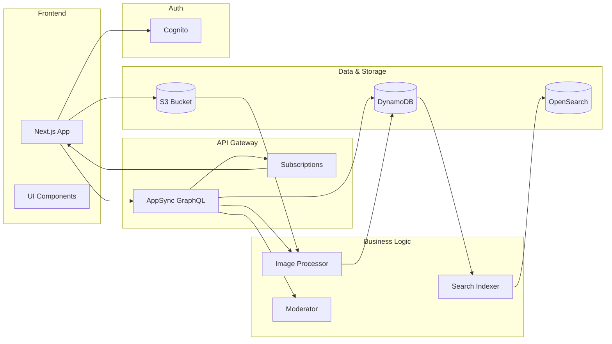

# Components

### Frontend Application
**Responsibility:** Next.js application providing the user interface, server-side rendering, and client-side interactivity

**Key Interfaces:**
- HTTP/HTTPS endpoints for page routes
- GraphQL client connection to AppSync API
- Amplify Auth integration for authentication flows
- Amplify Storage integration for image uploads

**Dependencies:** AppSync API, Cognito, S3/CloudFront

**Technology Stack:** Next.js 14.2, React 18.3, TypeScript, MUI 5.15, Amplify UI React 6.1, Tailwind CSS

### GraphQL API Layer
**Responsibility:** AppSync managed GraphQL API providing data operations, real-time subscriptions, and authorization

**Key Interfaces:**
- GraphQL schema with Queries, Mutations, and Subscriptions
- Type-safe resolvers for all data operations
- WebSocket connections for real-time updates
- Authorization rules per field/operation

**Dependencies:** DynamoDB, Lambda Functions, Cognito

**Technology Stack:** AWS AppSync (managed), GraphQL schema defined in Amplify

### Authentication Service
**Responsibility:** Cognito user pool managing user registration, authentication, and authorization

**Key Interfaces:**
- User registration and verification endpoints
- OAuth 2.0 flows for social login (Google, Facebook)
- JWT token generation and validation
- User group management for roles

**Dependencies:** None (foundational service)

**Technology Stack:** AWS Cognito (managed), Amplify Auth configuration

### Data Storage Layer
**Responsibility:** DynamoDB tables storing all application data with single-table design pattern

**Key Interfaces:**
- Single table with composite keys for all entities
- Global Secondary Indexes (GSIs) for query patterns
- DynamoDB Streams for change events
- Batch read/write operations

**Dependencies:** None (foundational service)

**Technology Stack:** AWS DynamoDB (managed), single-table design

### Image Processing Service
**Responsibility:** Lambda function processing uploaded images for optimization and multiple sizes

**Key Interfaces:**
- S3 event trigger on image upload
- Image resize to multiple dimensions (thumbnail, medium, large)
- Format optimization (WebP conversion)
- Metadata extraction and storage

**Dependencies:** S3, DynamoDB

**Technology Stack:** Node.js Lambda, Sharp 0.33.2, TypeScript

### Content Moderation Service
**Responsibility:** Lambda function reviewing flagged content and automating moderation workflows

**Key Interfaces:**
- AppSync resolver integration for flag operations
- Moderation queue management
- Automated content analysis rules
- Admin notification system

**Dependencies:** DynamoDB, AppSync API

**Technology Stack:** Node.js Lambda, TypeScript, AWS SDK

### Search Service
**Responsibility:** Lambda function managing OpenSearch indexing and search operations

**Key Interfaces:**
- DynamoDB Streams consumer for index updates
- Search query API endpoint
- Index management operations
- Relevance scoring algorithms

**Dependencies:** DynamoDB Streams, OpenSearch

**Technology Stack:** Node.js Lambda, OpenSearch client, TypeScript

### Media Storage
**Responsibility:** S3 bucket and CloudFront CDN storing and delivering images

**Key Interfaces:**
- Presigned URL generation for uploads
- CloudFront distribution for global delivery
- Image access policies and CORS configuration
- Lifecycle policies for cost optimization

**Dependencies:** None (foundational service)

**Technology Stack:** AWS S3 (managed), CloudFront CDN (managed)

### Component Diagrams


