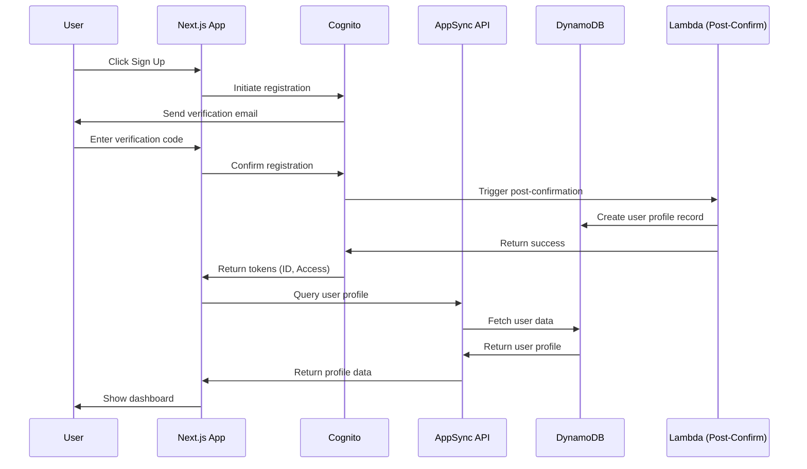
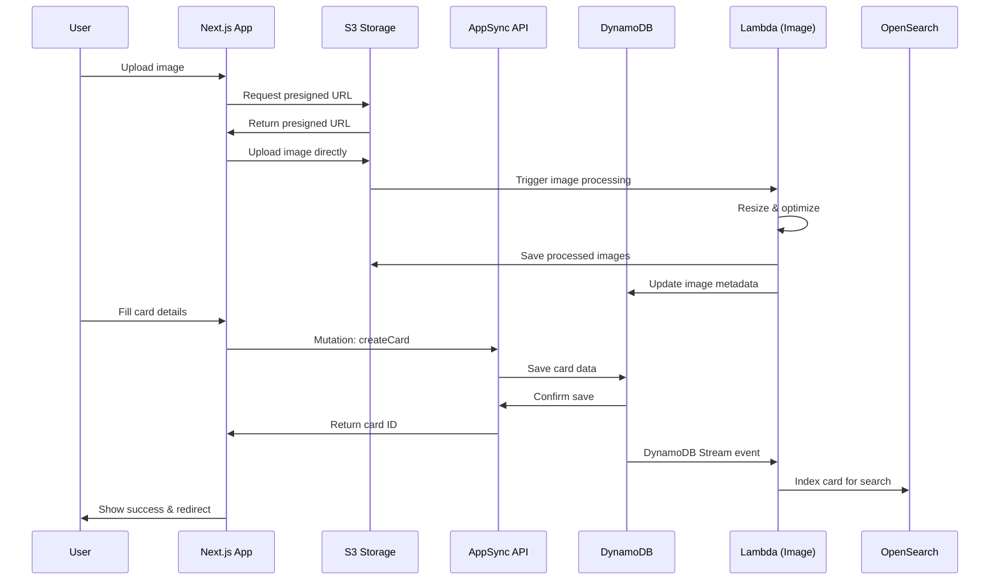
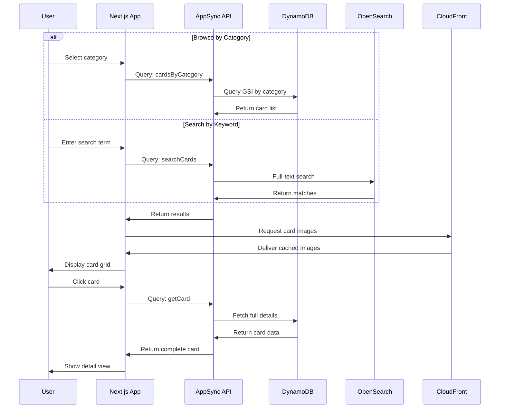
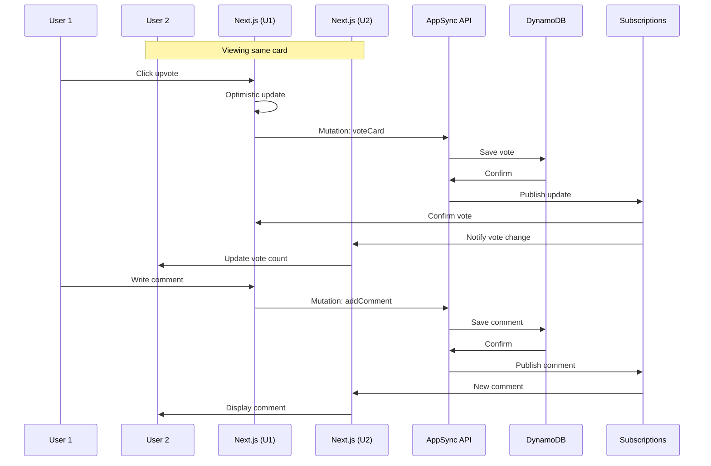
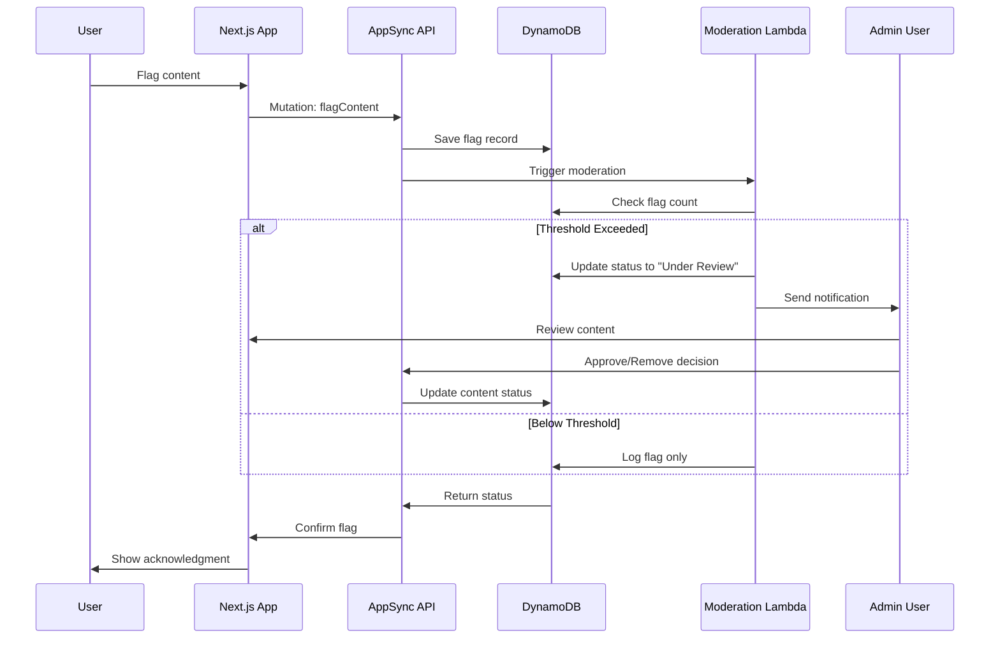

# Core Workflows

### User Registration and Authentication Flow

### Create Perfection Card Workflow

### Browse and Search Workflow

### Real-time Voting and Comments

### Content Moderation Workflow


