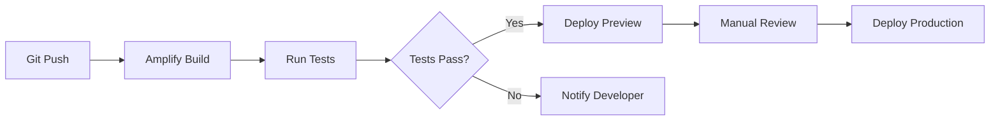

# Deployment & Operations

### CI/CD Pipeline



### Environment Strategy

| Environment | Purpose | Data | Access |
|------------|---------|------|--------|
| Local | Development | Mock data | Developers |
| Sandbox | Integration testing | Test data | Dev team |
| Staging | Pre-production validation | Prod-like data | QA team |
| Production | Live system | Real data | Public |

### Deployment Process

#### Amplify Hosting Configuration
```yaml
version: 1
frontend:
  phases:
    preBuild:
      commands:
        - npm ci
    build:
      commands:
        - npm run build
  artifacts:
    baseDirectory: .next
    files:
      - '**/*'
  cache:
    paths:
      - node_modules/**/*
```

#### Rollback Strategy
- **Blue-green deployment:** Zero-downtime updates
- **Canary releases:** 10% traffic to new version
- **Instant rollback:** One-click revert in Amplify Console
- **Database migrations:** Forward-compatible changes only

### Operational Procedures

#### Incident Response
1. **Detection:** CloudWatch alarm triggers
2. **Triage:** On-call engineer assesses severity
3. **Mitigation:** Apply immediate fix or rollback
4. **Resolution:** Root cause analysis and permanent fix
5. **Post-mortem:** Document lessons learned

#### Maintenance Windows
- **Scheduled:** Tuesday 2-4 AM EST
- **Notifications:** 48-hour advance notice
- **Types:** Security patches, infrastructure updates

