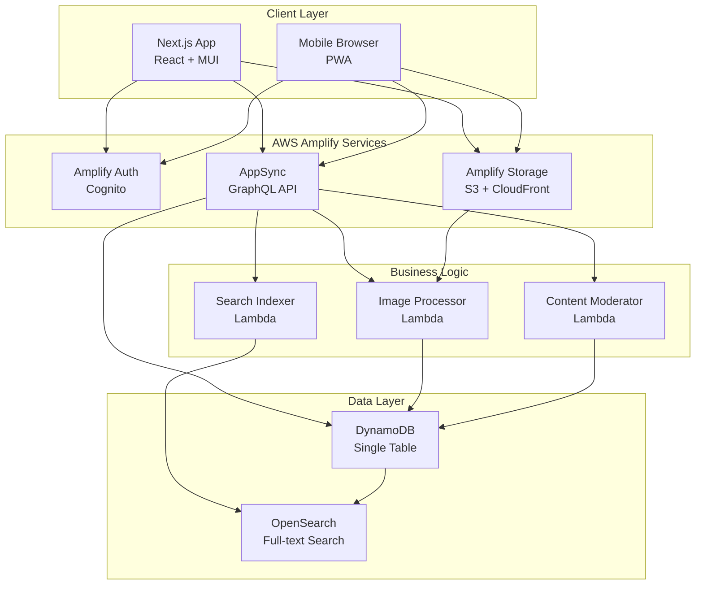

# High Level Architecture

### Technical Summary

PerfectIt employs a serverless architecture using AWS Amplify Gen 2, delivering a visual knowledge-sharing platform through event-driven patterns and managed AWS services. The system combines Next.js for server-side rendering with AppSync GraphQL API for real-time data operations, DynamoDB for scalable NoSQL storage, and S3/CloudFront for optimized image delivery. Core architectural patterns include CQRS for separating read/write operations, event-driven updates via AppSync subscriptions, and single-table design for DynamoDB optimization. This architecture directly supports the PRD goals of enabling rapid content discovery, real-time community engagement, and cost-effective scaling from startup to 10,000+ users.

### High Level Overview

**Architectural Style:** Serverless, Event-Driven Architecture leveraging AWS managed services for automatic scaling and operational simplicity.

**Repository Structure:** Monorepo (as specified in PRD) containing:
- `/app` - Next.js frontend application
- `/amplify` - Backend resource definitions (auth, data, storage, functions)
- `/components` - Shared React components
- Unified deployment and version control

**Service Architecture:** AWS Amplify Gen 2 Serverless with:
- AppSync GraphQL API as the primary service interface
- Lambda functions for custom business logic (image processing, moderation)
- DynamoDB for primary data storage with single-table design
- S3 + CloudFront for image storage and delivery
- Cognito for authentication and user management

**Primary User Flow:**
1. Users authenticate via Cognito (social or email/password)
2. Browse/search Perfection Cards through AppSync queries
3. Upload images to S3 via presigned URLs
4. Create/interact with content through GraphQL mutations
5. Receive real-time updates via AppSync subscriptions

**Key Architectural Decisions:**
- **Serverless-first:** Eliminates server management, provides automatic scaling
- **GraphQL over REST:** Enables precise data fetching, real-time subscriptions
- **Single-table DynamoDB:** Optimizes for cost and performance at scale
- **CDN-first media:** Reduces latency and backend load for images

### High Level Project Diagram

### Architectural and Design Patterns

- **Serverless Architecture:** Using AWS Lambda and managed services - *Rationale:* Aligns with PRD requirement for cost optimization within $50K budget, scales automatically from 0 to 10,000+ users
- **CQRS (Command Query Responsibility Segregation):** Separate GraphQL resolvers for reads (queries) and writes (mutations) - *Rationale:* Optimizes read performance for browsing/discovery while maintaining data consistency for card creation
- **Event-Driven Processing:** S3 events trigger Lambda for image processing, DynamoDB streams for search indexing - *Rationale:* Enables asynchronous processing without blocking user interactions
- **Single-Table Design:** All entities in one DynamoDB table with composite keys - *Rationale:* Reduces costs, improves query performance, simplifies data model as recommended for DynamoDB best practices
- **Repository Pattern:** Abstract data access through Amplify Data models - *Rationale:* Provides clean separation between business logic and data layer, enables future migration if needed
- **Optimistic UI Updates:** Client-side state updates before server confirmation - *Rationale:* Provides instant feedback for votes/comments improving perceived performance
- **Circuit Breaker Pattern:** For external service calls (OpenSearch, image processing) - *Rationale:* Prevents cascade failures and provides graceful degradation

