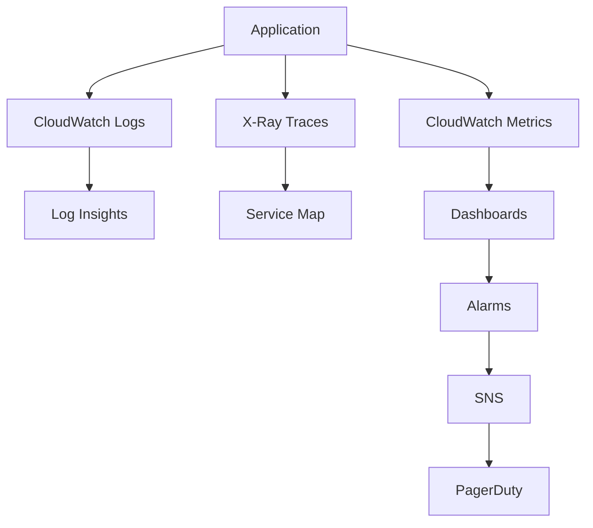

# Monitoring & Observability

### Metrics & KPIs

#### Business Metrics
- Daily/Monthly Active Users
- Card creation rate
- User engagement (votes, comments)
- Search conversion rate
- User retention (7-day, 30-day)

#### Technical Metrics
- API latency (p50, p95, p99)
- Error rates by service
- Lambda cold start frequency
- DynamoDB consumed capacity
- CloudFront cache hit ratio

### Monitoring Stack



### Logging Strategy

#### Log Levels
```typescript
enum LogLevel {
  ERROR = 'error',   // System errors, exceptions
  WARN = 'warn',     // Degraded performance
  INFO = 'info',     // Business events
  DEBUG = 'debug'    // Development only
}
```

#### Structured Logging
```json
{
  "timestamp": "2025-01-15T10:30:00Z",
  "level": "INFO",
  "service": "image-processor",
  "userId": "user123",
  "action": "image.upload",
  "duration": 1250,
  "metadata": {
    "fileSize": 2048000,
    "format": "jpeg"
  }
}
```

### Alerting Rules

| Alert | Condition | Severity | Response |
|-------|-----------|----------|----------|
| High Error Rate | > 5% errors | Critical | Page on-call |
| API Latency | p95 > 1s | Warning | Investigate |
| DynamoDB Throttle | Any throttles | Warning | Scale capacity |
| Lambda Timeout | > 10/minute | Critical | Check function |
| Low Disk Space | < 10% free | Warning | Clean logs |

### Dashboards

#### Operations Dashboard
- Service health status
- Real-time error rates
- API performance metrics
- Infrastructure utilization

#### Business Dashboard
- User growth trends
- Content creation metrics
- Engagement analytics
- Revenue metrics (future)

