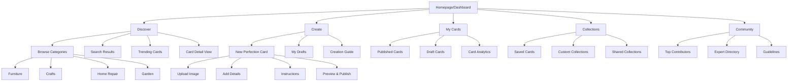
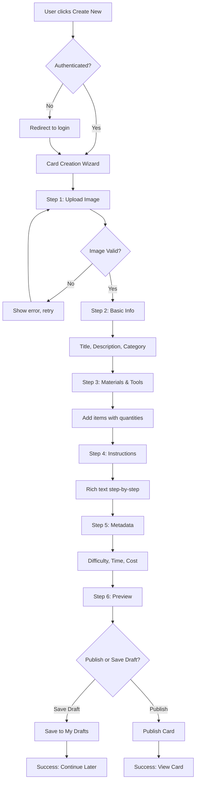
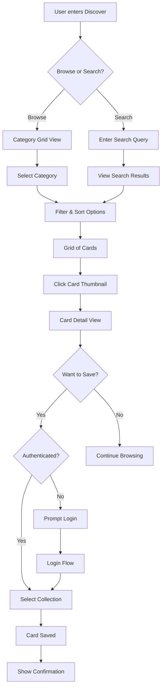
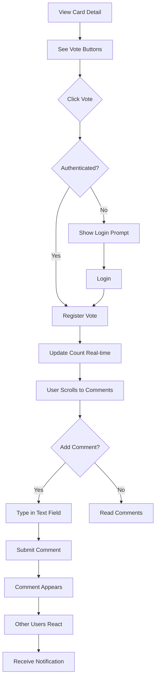

# PerfectIt UI/UX Specification

## Introduction

This document defines the user experience goals, information architecture, user flows, and visual design specifications for PerfectIt's user interface. It serves as the foundation for visual design and frontend development, ensuring a cohesive and user-centered experience.

### Overall UX Goals & Principles

#### Target User Personas

**DIY Enthusiast Emma** - Ages 25-55, suburban/rural, seeks clear visual instructions and cost-effective solutions. Browses Pinterest weekly, values community validation before starting projects. Needs confidence that techniques will work and appreciates step-by-step guidance with photos.

**Expert Craftsman Carlos** - Ages 30-65, skilled tradesperson/artist seeking platform to showcase expertise and mentor others. Creates high-quality content, values professional recognition, wants to preserve craft knowledge. Needs efficient tools for documenting techniques and building reputation.

**Casual Improver Alex** - Occasional user who discovers items needing improvement but lacks expertise. Values simplicity, quick wins, and projects under 2 hours. Needs filtering by difficulty and clear material lists to decide if project is feasible.

#### Usability Goals

- **Discoverability:** Users find relevant Perfection Cards within 30 seconds through search or browsing
- **Content Creation Efficiency:** Experts can create comprehensive Perfection Cards in under 10 minutes
- **Mobile Accessibility:** Core features fully functional on mobile devices for in-workshop reference
- **Trust Building:** Clear expertise indicators and community validation visible at a glance
- **Error Prevention:** Destructive actions require confirmation, drafts auto-save every 30 seconds

#### Design Principles

1. **Visual First, Always** - Every interaction starts with an image; text supports but never dominates
2. **Progressive Disclosure** - Show card thumbnails first, expand to summaries, then full instructions
3. **Community Trust Signals** - Upvotes, expertise badges, and success stories prominently displayed
4. **Frictionless Creation** - Guide creators through structured forms while allowing flexibility
5. **Accessible Craftsmanship** - WCAG AA compliance ensures everyone can perfect their items

### Change Log

| Date       | Version | Description                 | Author    |
| ---------- | ------- | --------------------------- | --------- |
| 2025-08-08 | 1.0     | Initial UI/UX Specification | UX Expert |

## Information Architecture (IA)

### Site Map / Screen Inventory



### Navigation Structure (MUI Dashboard Layout)

**Layout Framework:** Implementing MUI Dashboard template with fixed app bar, collapsible drawer navigation, and responsive main content area - exactly matching the MUI dashboard example structure.

**App Bar (Top Header):**

- Fixed position spanning full width (64px height desktop, 56px mobile)
- Left: Menu icon button (hamburger) to toggle drawer
- Center-left: PerfectIt logo/wordmark
- Center-right: Global search field with icon (Amplify UI SearchField component)
- Right section:
  - Notification icon badge (IconButton with Badge)
  - User avatar (Amplify UI Avatar) with dropdown menu
- Uses MUI AppBar with Toolbar component

**Left Navigation Drawer (Permanent on Desktop, Temporary on Mobile):**

- **Desktop:** Permanent drawer (240px width) with dividers between sections
- **Mobile/Tablet:** Temporary drawer with overlay, triggered by menu button
- **Content Structure:**

  ```
  [User Section]
  - Avatar + Name + Reputation Score
  - View Profile link

  [Divider]

  [Primary Navigation]
  - Dashboard (GridView icon)
  - Discover (Explore icon)
  - Create New (AddCircle icon)
  - My Cards (Folder icon)
  - Collections (Bookmarks icon)

  [Divider]

  [Community]
  - Top Contributors (EmojiEvents icon)
  - Expert Directory (VerifiedUser icon)
  - Guidelines (Article icon)

  [Divider]

  [Bottom Section - Sticky]
  - Settings (Settings icon)
  - Help (HelpOutline icon)
  - Sign Out (Logout icon)
  ```

**Main Content Area:**

- Uses MUI Container with responsive maxWidth
- Padding: 24px (desktop), 16px (mobile)
- Flex grow to fill available space
- Background: grey[50] for subtle contrast
- Content wrapped in Paper components where appropriate

**Responsive Breakpoints:**

- **Desktop (lg: 1200px+):** Permanent drawer, full search bar
- **Tablet (md: 900px-1199px):** Permanent mini drawer, condensed search
- **Mobile (xs/sm: <900px):** Temporary drawer, search icon only

## User Flows

### Flow 1: Create Perfection Card

**User Goal:** Document and share an improvement technique for an item

**Entry Points:**

- Dashboard "Create New Card" CTA button
- Left drawer "Create New" navigation item
- Empty state "Create your first card" button

**Success Criteria:** Published Perfection Card visible in user's profile and discoverable by others

#### Flow Diagram



#### Edge Cases & Error Handling:

- Image upload fails: Show retry with error message, allow URL input as fallback
- Network interruption: Auto-save draft every 30 seconds, show recovery option
- Duplicate detection: Warn if similar card exists, allow continuation
- Missing required fields: Inline validation, prevent progression until complete

**Notes:** Wizard uses MUI Stepper component with Amplify UI FileUploader for images

### Flow 2: Discover and Save Cards

**User Goal:** Find relevant Perfection Cards and save them for future reference

**Entry Points:**

- Dashboard trending cards section
- Discover menu item in drawer
- Search bar in app header

**Success Criteria:** User finds relevant card and saves to collection within 60 seconds

#### Flow Diagram



#### Edge Cases & Error Handling:

- No search results: Show suggestions and popular cards
- Slow image loading: Progressive loading with blur-up effect
- Collection limit reached: Prompt to upgrade or manage collections
- Already saved: Show "Already in collection" with link to view

**Notes:** Uses Amplify UI Collection component with StorageImage for optimal performance

### Flow 3: Community Engagement

**User Goal:** Interact with Perfection Cards through voting and commenting

**Entry Points:**

- Card detail view
- Activity feed on dashboard
- Notification about comment reply

**Success Criteria:** User successfully votes and comments, sees real-time update

#### Flow Diagram



#### Edge Cases & Error Handling:

- Rate limiting: Show cooldown message if voting too frequently
- Comment moderation: Queue for review if flagged keywords detected
- Network offline: Cache vote locally, sync when connection restored
- Profanity filter: Block submission with warning message

**Notes:** Real-time updates via AppSync subscriptions

## Wireframes & Mockups

**Primary Design Files:** To be created in Figma or using AI generation tools (v0, Lovable)

### Key Screen Layouts

#### Dashboard (Homepage)

**Purpose:** Provide personalized overview and quick access to primary actions

**Key Elements:**

- Welcome banner with user's name and reputation score
- "Create New Card" prominent CTA button (MUI Fab or Button)
- Trending Cards carousel (horizontal scroll, 4-6 visible)
- Recent activity feed (cards, comments, votes on user's content)
- Quick stats widgets (views this week, total cards, collections)

**Interaction Notes:** Cards show preview on hover with vote count and save button. Single click navigates to detail view.

**Design File Reference:** Dashboard_Desktop_v1, Dashboard_Mobile_v1

#### Perfection Card Detail View

**Purpose:** Display complete card information and enable community interaction

**Key Elements:**

- Hero image with fullscreen expand option (Amplify UI StorageImage)
- Title, author info with expertise badges
- Vote buttons and count (prominent placement)
- Tab panel: Instructions | Materials | Comments
- Floating save button (MUI SpeedDial on mobile)
- Related cards grid at bottom

**Interaction Notes:** Sticky header with title when scrolling. Comments load progressively. Image zoom on click.

**Design File Reference:** CardDetail_Desktop_v1, CardDetail_Mobile_v1

#### Card Creation Wizard

**Purpose:** Guide users through structured card creation process

**Key Elements:**

- MUI Stepper component showing 6 steps
- Step 1: Amplify UI FileUploader with drag-drop zone
- Step 2-5: Form fields with inline validation
- Step 6: Preview matching detail view layout
- Progress bar and auto-save indicator
- Back/Next navigation buttons

**Interaction Notes:** Can navigate between completed steps freely. Draft saves automatically every 30 seconds.

**Design File Reference:** CreateWizard_AllSteps_v1

#### Discover/Browse Page

**Purpose:** Enable exploration and filtering of Perfection Cards

**Key Elements:**

- Filter sidebar (collapsible on mobile)
- Sort dropdown (newest, popular, trending)
- Amplify UI Collection grid (responsive columns)
- Load more button or infinite scroll
- Category pills for quick filtering

**Interaction Notes:** Filters apply instantly. URL updates for shareable searches. Skeleton loading for images.

**Design File Reference:** Discover_Desktop_v1, Discover_Mobile_v1

## Component Library / Design System

**Design System Approach:** Hybrid approach leveraging MUI's comprehensive component library with Amplify UI's connected components for AWS integration. Custom theme extends MUI's default with PerfectIt brand colors and typography.

### Core Components

#### PerfectionCard Component

**Purpose:** Display card preview in grids and lists throughout the application

**Variants:**

- Grid view (square aspect ratio with overlay)
- List view (horizontal layout with metadata)
- Mini view (dashboard widgets)
- Featured view (hero carousel)

**States:** Default, Hover (elevation change), Loading (skeleton), Error (fallback image)

**Usage Guidelines:** Always use Amplify UI StorageImage for images. Include vote count and save button on hover. Maintain 16:9 aspect ratio for images.

#### VoteButton Component

**Purpose:** Enable upvoting/downvoting with real-time updates

**Variants:**

- Inline (card grids)
- Prominent (detail view)
- Compact (comments)

**States:** Default, Voted, Disabled, Loading

**Usage Guidelines:** Always pair upvote/downvote. Show count between buttons. Use optimistic updates with rollback on error.

#### CollectionSelector Component

**Purpose:** Allow users to save cards to collections

**Variants:**

- Dropdown menu
- Modal with checkboxes
- Quick save button

**States:** Default, Open, Saving, Saved

**Usage Guidelines:** Show existing collections first. Include "Create New" option. Indicate if card already in collection.

#### ExpertiseBadge Component

**Purpose:** Display user expertise and verification status

**Variants:**

- Small (inline with username)
- Medium (profile cards)
- Large (profile header)

**States:** Unverified, Verified, Expert, Master

**Usage Guidelines:** Use MUI Chip with custom colors. Include tooltip with endorsement count. Link to user profile on click.

#### FilterPanel Component

**Purpose:** Provide filtering options for browse/search pages

**Variants:**

- Sidebar (desktop)
- Bottom sheet (mobile)
- Horizontal pills (simple filters)

**States:** Collapsed, Expanded, Active filters

**Usage Guidelines:** Group related filters. Show active filter count when collapsed. Include "Clear all" option.

## Branding & Style Guide

### Visual Identity

**Brand Guidelines:** PerfectIt brand emphasizes precision, craftsmanship, and community expertise

### Color Palette

| Color Type | Hex Code                  | Usage                                     |
| ---------- | ------------------------- | ----------------------------------------- |
| Primary    | #D2691E                   | Main CTAs, primary buttons, active states |
| Secondary  | #8B4513                   | Secondary actions, hover states           |
| Accent     | #FF8C00                   | Highlights, badges, notifications         |
| Success    | #4CAF50                   | Positive feedback, save confirmations     |
| Warning    | #FF9800                   | Cautions, draft status                    |
| Error      | #F44336                   | Errors, delete actions                    |
| Neutral    | #757575, #E0E0E0, #F5F5F5 | Text, borders, backgrounds                |

### Typography

#### Font Families

- **Primary:** Roboto (Google Font) - Clean, readable, works across devices
- **Secondary:** Roboto Slab - For headings and emphasis
- **Monospace:** Roboto Mono - For measurements, time estimates

#### Type Scale

| Element | Size | Weight | Line Height |
| ------- | ---- | ------ | ----------- |
| H1      | 32px | 500    | 1.2         |
| H2      | 24px | 500    | 1.3         |
| H3      | 20px | 500    | 1.4         |
| Body    | 16px | 400    | 1.5         |
| Small   | 14px | 400    | 1.4         |

### Iconography

**Icon Library:** Material Icons (MUI default) for consistency

**Usage Guidelines:**

- Use outlined variants for navigation
- Filled variants for active states
- Two-tone for decorative elements
- Maintain 24px default size, 20px for dense layouts

### Spacing & Layout

**Grid System:** 12-column responsive grid (MUI Grid v2)

**Spacing Scale:** 8px base unit (8, 16, 24, 32, 48, 64)

- Tight: 8px (within components)
- Default: 16px (between related elements)
- Comfortable: 24px (between sections)
- Spacious: 32px+ (major sections)

## Accessibility Requirements

### Compliance Target

**Standard:** WCAG 2.1 Level AA

### Key Requirements

**Visual:**

- Color contrast ratios: Minimum 4.5:1 for normal text, 3:1 for large text
- Focus indicators: Visible outline with 3:1 contrast ratio against background
- Text sizing: Base font 16px minimum, user scalable up to 200%

**Interaction:**

- Keyboard navigation: All interactive elements accessible via Tab key, logical tab order
- Screen reader support: Proper ARIA labels, roles, and descriptions
- Touch targets: Minimum 44x44px for mobile, 24x24px with adequate spacing on desktop

**Content:**

- Alternative text: Descriptive alt text for all Perfection Card images
- Heading structure: Logical h1-h6 hierarchy, no skipped levels
- Form labels: All inputs with associated labels or aria-label

### Testing Strategy

Automated testing with axe-core, manual keyboard navigation testing, screen reader testing with NVDA/JAWS, color contrast validation with Chrome DevTools

## Responsiveness Strategy

### Breakpoints

| Breakpoint | Min Width | Max Width | Target Devices         |
| ---------- | --------- | --------- | ---------------------- |
| Mobile     | 0px       | 599px     | Phones                 |
| Tablet     | 600px     | 959px     | Tablets, small laptops |
| Desktop    | 960px     | 1279px    | Laptops, desktops      |
| Wide       | 1280px    | -         | Large monitors         |

### Adaptation Patterns

**Layout Changes:**

- Mobile: Single column, stacked elements, full-width cards
- Tablet: 2-column grid for cards, collapsible sidebar
- Desktop: 3-4 column grid, permanent sidebar
- Wide: 5-6 column grid, expanded content area

**Navigation Changes:**

- Mobile: Hamburger menu, bottom tab bar for key actions
- Tablet: Mini drawer with icons only
- Desktop+: Full drawer with labels

**Content Priority:**

- Mobile: Image first, essential info only, progressive disclosure
- Tablet: Image + summary, key metadata visible
- Desktop: Full preview with all metadata

**Interaction Changes:**

- Mobile: Touch-optimized, swipe gestures, bottom sheets
- Tablet: Mixed touch/mouse, hover states on capable devices
- Desktop: Full hover interactions, keyboard shortcuts

## Animation & Micro-interactions

### Motion Principles

- Purpose-driven: Every animation serves a functional purpose
- Fast and smooth: 200-300ms for most transitions
- Natural easing: Use Material Design standard easing curves
- Respect preferences: Honor prefers-reduced-motion settings

### Key Animations

- **Card hover:** Scale 1.02, elevation increase, 200ms, ease-out
- **Page transitions:** Fade in, 300ms, ease-in-out
- **Drawer toggle:** Slide, 225ms, Material standard easing
- **Vote action:** Bounce effect, 300ms, ease-out
- **Save to collection:** Checkmark morph, 400ms, ease-in-out
- **Loading skeletons:** Shimmer effect, 1.5s, linear infinite

## Performance Considerations

### Performance Goals

- **Page Load:** First Contentful Paint < 1.5s, Time to Interactive < 3s
- **Interaction Response:** < 100ms for user input feedback
- **Animation FPS:** Consistent 60fps for all animations

### Design Strategies

- Lazy load images below the fold using Amplify UI StorageImage
- Progressive image loading with blur-up placeholders
- Virtual scrolling for long lists (>50 items)
- Debounce search and filter inputs (300ms)
- Optimize bundle size with code splitting by route
- Use CSS transforms for animations (GPU accelerated)
- Implement skeleton screens during data fetching

## Next Steps

### Immediate Actions

1. Create MUI theme configuration file with brand colors and typography
2. Configure Amplify UI ThemeProvider with custom theme matching MUI brand colors
3. Build component library in Storybook for development
4. Create Figma/design file with all screen layouts
5. Conduct accessibility audit of initial components
6. Test responsive breakpoints across devices

### Theme Integration Strategy

#### MUI as Primary Theme System

Material-UI provides the primary theming system for the application, with custom theme defined in `lib/theme/theme.ts`.

#### Amplify UI Component Theming

For Amplify UI components (primarily the Authenticator), apply consistent theming via:

1. **ThemeProvider Wrapper:**

```typescript
import { ThemeProvider } from '@aws-amplify/ui-react';
import { defaultTheme } from '@aws-amplify/ui-react';

const customTheme = {
  name: 'perfectit-theme',
  tokens: {
    colors: {
      brand: {
        primary: {
          10: '#FFF4E6',
          20: '#FFE0B2',
          80: '#D2691E',
          90: '#8B4513',
          100: '#5D2F0B'
        }
      }
    },
    components: {
      authenticator: {
        router: {
          borderColor: '{colors.brand.primary.80}'
        }
      }
    }
  }
};

// Wrap Amplify UI components
<ThemeProvider theme={customTheme}>
  <Authenticator />
</ThemeProvider>
```

2. **Accessing Theme Values:**
   Use the `useTheme()` hook within components:

```typescript
import { useTheme } from '@aws-amplify/ui-react';

function CustomComponent() {
  const { tokens } = useTheme();
  return <div style={{ color: tokens.colors.brand.primary[80] }}>...</div>;
}
```

3. **Color Palette Alignment:**
   Ensure Amplify UI theme colors match MUI palette:

- Primary: #D2691E (matches MUI primary.main)
- Secondary: #8B4513 (matches MUI secondary.main)
- Error: #F44336 (matches MUI error.main)
- Success: #4CAF50 (matches MUI success.main)

### Design Handoff Checklist

- ✓ All user flows documented
- ✓ Component inventory complete
- ✓ Accessibility requirements defined
- ✓ Responsive strategy clear
- ✓ Brand guidelines incorporated
- ✓ Performance goals established

## Checklist Results

_To be completed after running UX checklist against this specification._
